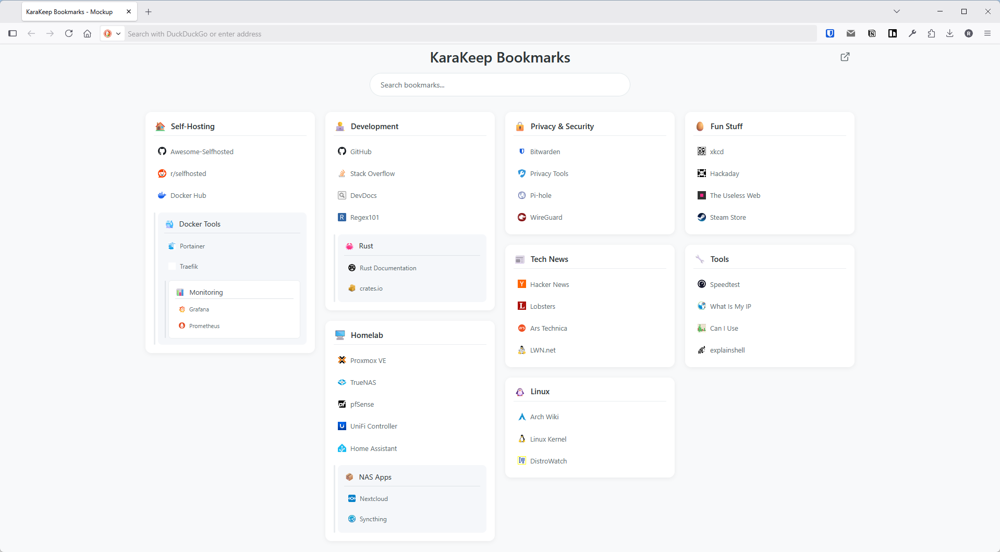

# KaraKeep Companion

A more compact view for browsing your [KaraKeep](https://github.com/karakeep-app/karakeep) bookmarks. All Karakeep bookmarks are shown on one single page, organized by lists.  



## Features

- 📚 **Masonry Layout** - Efficient use of screen space with Pinterest-style columns
- 🔍 **Real-time Search** - Instantly filter bookmarks as you type
- 🖱️ **Drag & Drop** - Reorder lists to your preference
- 📱 **Responsive** - Works beautifully on desktop, tablet, and mobile
- 🚀 **Fast** - SQLite WASM runs entirely in your browser
- 🔒 **Privacy-First** - Your data never leaves your device

## Quick Start with Docker

### Prerequisites
- Docker and Docker Compose installed
- Access to your KaraKeep `db.db` file through a docker volume

### Using Pre-built Image

1. Create a `docker-compose.yml` file:

```yaml
version: '3.8'

services:
  karakeep-companion:
    image: ghcr.io/YOUR_USERNAME/karakeep-companion:latest
    container_name: karakeep-companion
    ports:
      - "8000:8000"
    volumes:
      # Update path to your KaraKeep database
      - /path/to/karakeep/db.db:/app/db.db:ro
      # Config directory for persistence
      - ./config:/app/config
    restart: unless-stopped
```

2. Start the container:
```bash
docker-compose up -d
```

3. Open http://localhost:8000 in your browser

## Manual Installation

### Prerequisites
- Python 3.7+ (for the server)
- Your KaraKeep `db.db` file

### Setup

1. Clone the repository:
```bash
git clone https://github.com/YOUR_USERNAME/karakeep-companion.git
cd karakeep-companion
```

2. Copy your KaraKeep database:
```bash
cp /path/to/karakeep/db.db .
```

3. Start the server:
```bash
python server.py
```

4. Open http://localhost:8000 in your browser

## Configuration

The application uses a `config/config.json` file for settings. If it doesn't exist, it will be created automatically with defaults.

### Configuration Options

```json
{
  "karakeepUrl": "http://localhost:3000",
  "bookmarkTarget": "_self",
  "preferences": {
    "columnOrder": []
  }
}
```

| Option | Description | Default |
|--------|-------------|---------|
| `karakeepUrl` | URL to your KaraKeep instance | `http://localhost:3000` |
| `bookmarkTarget` | Where to open bookmarks: `_self` (same tab) or `_blank` (new tab) | `_self` |
| `preferences.columnOrder` | Saved order of bookmark lists (managed automatically) | `[]` |

## Building Your Own Docker Image

### Automatic Build with GitHub Actions

1. Fork this repository
2. Go to Settings → Actions → General
3. Under "Workflow permissions", select "Read and write permissions"
4. Enable GitHub Actions in your fork
5. Push to the `main` branch or create a tag (e.g., `v1.0.0`)
6. The image will be automatically built and published to GitHub Container Registry

### Manual Build

```bash
# Build the image
docker build -t karakeep-companion .

# Tag for GitHub Container Registry
docker tag karakeep-companion ghcr.io/YOUR_GITHUB_USERNAME/karakeep-companion:latest

# Login to GitHub Container Registry
echo $GITHUB_TOKEN | docker login ghcr.io -u YOUR_GITHUB_USERNAME --password-stdin

# Push the image
docker push ghcr.io/YOUR_GITHUB_USERNAME/karakeep-companion:latest
```

To use your custom image, update the docker-compose.yml:
```yaml
image: ghcr.io/YOUR_GITHUB_USERNAME/karakeep-companion:latest
```

## Project Structure

```
karakeep-companion/
├── index.html             # Main HTML file
├── styles.css             # Styling
├── app.js                 # Application logic
├── server.py              # Python web server
├── config/                # Configuration directory (created automatically)
│   └── config.json        # User preferences
├── Dockerfile             # Docker build instructions
├── docker-compose.yml     # Docker Compose example
├── .dockerignore          # Docker ignore file
├── .github/               # GitHub Actions
│   └── workflows/
│       └── docker-publish.yml
├── mockup.html            # Screenshot generator
└── README.md              # This file
```

## Development

### Running Locally

For development without Docker:

```bash
# Install dependencies (none required!)

# Start the development server
python server.py

# Or use any static file server if you don't need preference persistence
python -m http.server 8000
```

### Making Changes

1. Edit the HTML, CSS, or JavaScript files
2. Refresh your browser to see changes
3. Submit a pull request with your improvements!

### Generating Screenshots

To create a screenshot for documentation:

1. Open `mockup.html` in your browser
2. Resize window to 1440px width
3. Take a screenshot
4. Save as `screenshot.png`

The mockup includes sample bookmarks tailored for self-hosting enthusiasts!

## Troubleshooting

### "Could not find db.db"
Make sure your KaraKeep database is in the correct location:
- For Docker: Check your volume mount path in docker-compose.yml
- For manual installation: Copy db.db to the project directory

### Bookmarks not showing
- Verify your db.db file is from KaraKeep
- Check browser console for errors
- Ensure the database contains bookmarks

### Drag and drop not saving
- The config directory must be writable
- For Docker: Ensure the ./config volume is properly mounted

## Contributing

Contributions are welcome! Please feel free to submit a Pull Request.

## License

This project is licensed under the MIT License - see the LICENSE file for details.

## Acknowledgments

- Built to complement [KaraKeep](https://github.com/karakeep-app/karakeep)
- Uses [SQLite WASM](https://sqlite.org/wasm/doc/trunk/index.md) for browser-based database access
- Inspired by modern bookmark managers and Pinterest's masonry layout